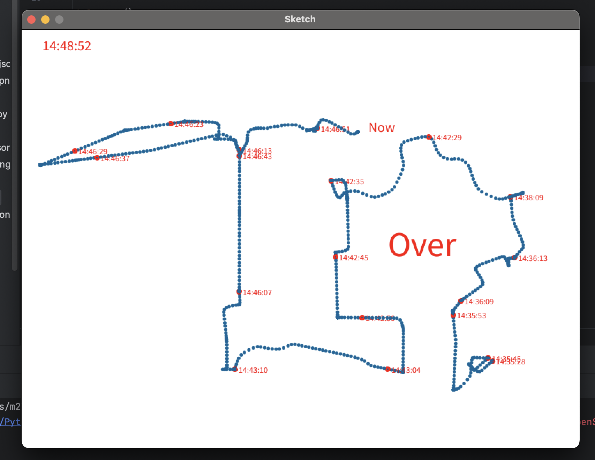

## opt1-3

旋转的部分没有做出来，因为不知道如何同时在绘制轨迹时再旋转另一张画布。

程序的主要思路是，先把坐标数据单独拿出来放在一个列表里，设置一个flag作为index，
因为draw函数会循环执行，在每次执行时画出一个列表里的坐标，然后让flag+1，这样下次循环就是下一个坐标了，

最后当flag大于列表长度时进入结束部分。

---

回転する部分はまだ作っていません。軌跡を描画しながら、別のキャンバスを同時に回転させる方法がわからないからです。

プログラムの主な考え方は、まず座標データをリストにまとめて、flagというインデックスとして使う変数を設定します。
draw関数はループで実行されるため、毎回そのリストから1つの座標を描画し、flagを1増やすことで、次のループでは次の座標が描かれます。

最後に、flagがリストの長さを超えたら、終了の部分に入ります。
