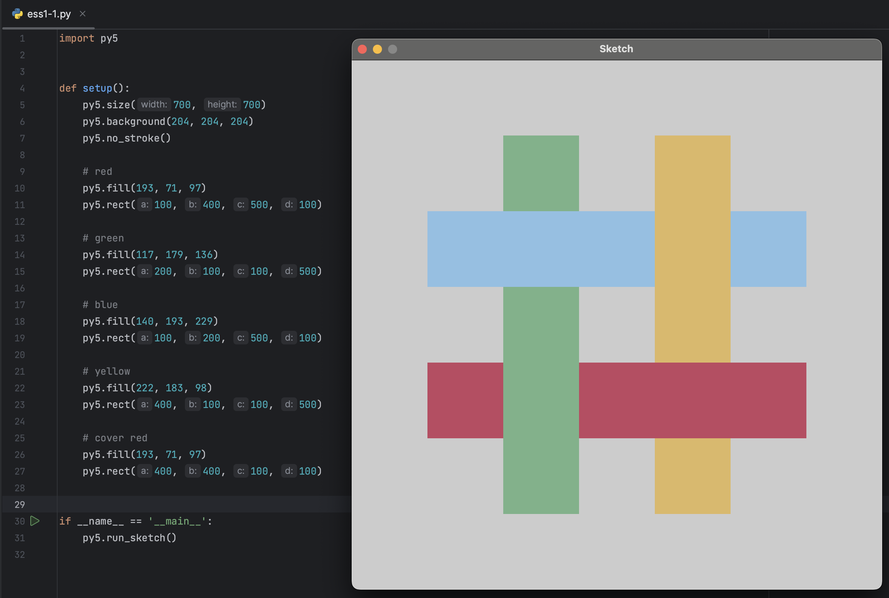
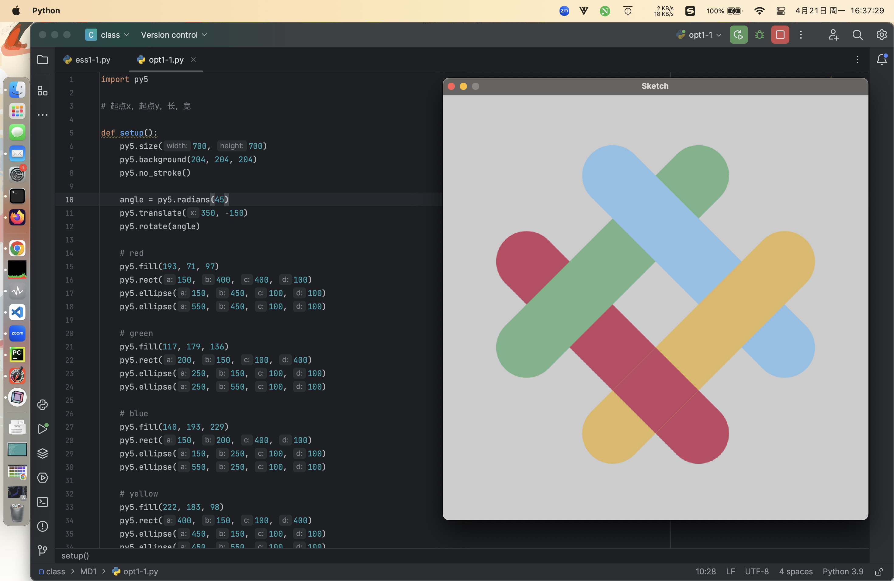
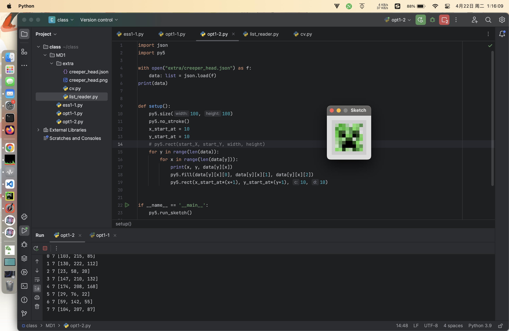

## All of these are translated by ChatGPT.
# ESS1-1



上記のプログラムはpy5ライブラリを使用して作成されています。以下はその説明です。

py5.size キャンバスのサイズを設定 

py5.background 背景色を設定 

py5.no_stroke() 描画する図形の枠線を無効にする

## 図形を描く

py5.fill 次に描画する図形の色を設定 

py5.rect 長方形を描画します。最初の2つのパラメータで位置を決定し、後の2つでサイズを決定します。

最後に黄色い長方形を描画すると、最初に描いた赤い長方形の一部が上書きされるので、もう一度赤色を使用し、赤い長方形と黄色い長方形が重なっている場所に赤い正方形を描きます。

最後に、py5.run_sketch()を呼び出して、setup関数の外部で関数を実行します。


# OPT1-1



前のプログラムにいくつかの行が追加されました。

py.radiansを使用して回転角度を定義し、ラジアンに変換します。このプログラムでは例えば45度です。

py5.translate キャンバスのオフセットを設定します。指定しない場合、キャンバスは（0, 0）を基準に回転します。

このプログラムでは（350, -150）に設定し、図形がより中心に見えるようにしています。

py5.rotate(angle) 回転を行います。rotateはラジアンでしか使用できないため、py.radiansで変換した角度（変数angle）を変数として渡します。

円は半径が50なので、長方形の両端からそれぞれ50を引く必要があります（総長さから100を引く）。

同時に、長方形の開始点も後ろに50ずらして中央に配置します。 

そのため、長方形を描いた後、両端に円を描く関数を追加します。

この時、fill関数は上書きされていないため、再度色を設定する必要はありません。


# OPT1-2



creeperのmobスキンファイルを全部調整するのは少し手間だったため、顔だけを描きました。申し訳ありません。

まず、Creeperのスキンを探し、このサイトからダウンロードしました。
（出典はこちら：https://www.planetminecraft.com/mob-skin/creeper-real-skin/）

ダウンロード後、Windowsのペイントツールを使って、Creeperの顔部分（8x8の領域）を切り取りました。  

そしてOpenCVを使って、各ピクセルのRGB値を読み取りました。

## OpenCV部分  

まず画像を読み込み、shape関数を使って画像の縦と横のサイズを取得します。  

その後、ループで読み込むデータを保存するための空のリストを作成します。

ループは画像の縦と横のサイズに従って進めます。

まずはY、つまり行をループし、  
その中でX、つまり列のループをネストします。  
（以下の説明では少し混乱しているかもしれませんが、要するにYは行、Xは列に対応します）

1行分すべての座標のBGRを読み込んだら、Xのループを抜けてYのループに戻り、次の行に進みます。

各行のデータを一時的に保存するリストをXループの外に用意し、それぞれの行が1つのリストになるように整理します。  
行のデータは列のループで変化するため、Yのループの中にこのリストを再定義することで、各行ごとにリストがリセットされます。

最終的に、以下のような3重のリスト構造になります：

```json
[
  [
    [R, G, B],
    [R, G, B]
  ],
  [
    [R, G, B],
    [R, G, B]
  ]
]
```

このデータをJSONファイルとして出力し、必要な場所で読み込めばOKです。

---

## 描画部分  
JSONファイル中のリスト構造を元に逆変換することで描画します。  
forループではrange(len())を使用してインデックスを取得し、これをもとに図形の位置を調整します。

このバージョンではキャンバスサイズを手動で調整する必要があります。  
修正済みのバージョンのコードは少し長くなるので、GitHubにアップしました
（リンク：https://github.com/kiraraOwO/MD2025/blob/main/class/1/opt1-2_EX.py）
